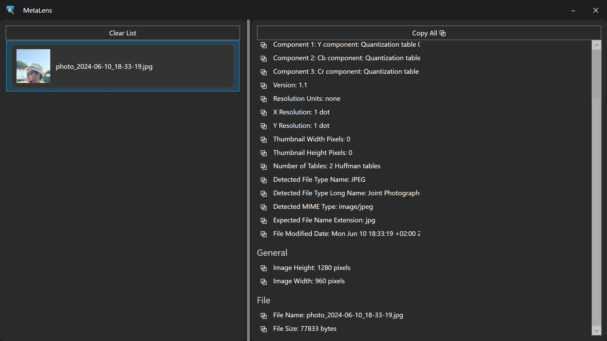



<p align="center">
  
</p>

<h1 align="center">MetaLens</h1>

MetaLens is a lightweight Windows desktop tool built with WPF (.NET) for viewing images and extracting metadata (EXIF).

---

## 🚀 Features (v1)

- Drag & Drop image support  
- Image thumbnail list  
- EXIF / metadata viewer  
- Organized metadata categories  
- One-click copy of metadata values  
- Clear image list  
- Custom dark UI  
- Custom title bar (minimize / close)  
- Responsive layout  

---

## 🧠 Metadata System

MetaLens uses a mapping file to organize raw EXIF metadata into readable categories.

### File:
metadata-map.json

### What it does:
- Groups raw EXIF tags into readable names  
- Normalizes inconsistent metadata keys  
- Makes metadata easier to browse  
- Fully editable without changing code  

### Example:
```json
{
  "Make": "Camera Brand",
  "Model": "Camera Model",
  "DateTimeOriginal": "Capture Date"
}
```
---

## 🖼 Preview



---

## 🛠 Tech Stack

- .NET (WPF)
- C#
- XAML

---

## 📦 How to Run

1. Clone repository:

```bash
git clone https://github.com/M3h245/MetaLens.git
```

2. Open solution in Visual Studio  
3. Restore NuGet packages (if needed)  
4. Run project  

---

## 💡 Planned Features

- Image preview panel  
- Search in metadata  
- Export metadata to JSON / TXT  
- Better drag & drop UX  
- Performance optimization  
- Advanced metadata engine  

---
## 🧭 Future Updates / Roadmap

Planned improvements for upcoming versions of MetaLens:

### 🧹 Metadata Management
- Manual removal of individual metadata entries  
- Selective deletion of metadata fields  

### 🗂 Bulk Actions
- Remove multiple metadata items at once  
- Batch cleanup by category (EXIF groups)  
- Quick "clear selected group" feature  

### ⚡ UX Improvements
- Faster metadata rendering for large image sets  
- Improved drag & drop feedback  
- Better selection handling in image list  

### 📦 Export Features (Planned)
- Export cleaned metadata to JSON  
- Export to TXT / CSV formats  


> These features are under active development and will be added in future releases.

---

## 📄 License

MIT License

---

## ☕ Support

If you like this project:

https://buymeacoffee.com/m3h245

Thanks for your support ❤️